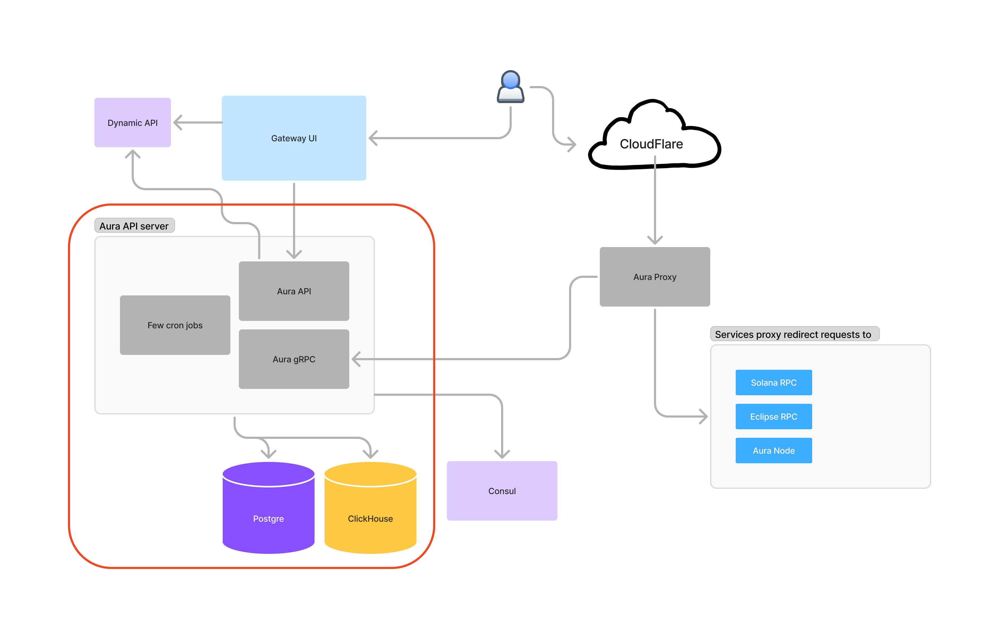

# Aura API

This repository contains the core API services that power the Aura platform. The diagram below illustrates the complete project architecture, with components in this repository highlighted in red.



## Core Components

The Aura API consists of several integrated services:

### 1. REST API Gateway
Serves the frontend UI with endpoints for:
- User authentication and authorization
- API key management
- Usage statistics and reporting
- Subscription and billing information

### 2. gRPC Service
Facilitates communication with the Aura Proxy by:
- Providing user plan information and validation
- Receiving and processing usage statistics from the proxy
- Storing analytics data in ClickHouse databases

### 3. Scheduled Jobs
The API maintains several critical background processes:

#### Data Aggregation Service
- Aggregates usage statistics by hour and day
- Optimizes database performance through strategic data retention
- Prepares provider performance data for rewards calculation
- Runs on configurable schedules

#### Rewards Calculation Service
- Calculates daily provider rewards based on usage
- Updates reward balances in PostgreSQL

#### Payment Monitoring Service
- Monitors the blockchain for new payment transactions
- Validates transaction authenticity and completion
- Updates billing status accordingly

## Getting Started

### Prerequisites

Project depends on PostgreSQL, ClickHouse, [Consul](https://www.consul.io) and [Dynamic](https://www.dynamic.xyz). Without that services up and running Aura API will not be launched completely.

### Configuration
1. Clone the repository
2. Create a `.env` file based on the provided `.env.example`
3. Speed up PostgreSQL. There is `docker-compose-postgre.yml` file to launch it locally
4. Speed up ClickHouse. There is `docker-compose-clickhouse.yml` file to launch it locally
5. Upload necessary configs to the Consul
6. Setup Dynamic

### Consul files examples

File path `config/aura-api/pricing`.

File example:
```
{
    "free": {
        "solana_das": {
            "requests_per_second": 10,
            "price_usd": 0
        },
        "eclipse_das": {
            "requests_per_second": 10,
            "price_usd": 0
        },
        "solana_rpc": {
            "requests_per_second": 10,
            "price_usd": 0
        },
        "eclipse_rpc": {
            "requests_per_second": 10,
            "price_usd": 0
        },
        "solana_get_program_accounts": {
            "requests_per_second": 0,
            "price_usd": 0
        },
        "eclipse_get_program_accounts": {
            "requests_per_second": 0,
            "price_usd": 0
        },
        "solana_swqos": {
            "requests_per_second": 0,
            "price_usd": 0
        },
        "eclipse_swqos": {
            "requests_per_second": 0,
            "price_usd": 0
        },
        "solana_websocket": {
            "requests_per_second": 0,
            "price_usd": 0
        },
        "eclipse_websocket": {
            "requests_per_second": 0,
            "price_usd": 0
        },
        "monthly_price_mplx": null,
        "priority_support": false
    },
    "developer": {
        "solana_das": {
            "requests_per_second": 75,
            "price_usd": 0.0000380
        },
        "eclipse_das": {
            "requests_per_second": 75,
            "price_usd": 0.0000380
        },
        "solana_rpc": {
            "requests_per_second": 50,
            "price_usd": 0.0000048
        },
        "eclipse_rpc": {
            "requests_per_second": 50,
            "price_usd": 0.0000048
        },
        "solana_get_program_accounts": {
            "requests_per_second": 25,
            "price_usd": 0.0000475
        },
        "eclipse_get_program_accounts": {
            "requests_per_second": 25,
            "price_usd": 0.0000475
        },
        "solana_swqos": {
            "requests_per_second": 20,
            "price_usd": 0.0001900
        },
        "eclipse_swqos": {
            "requests_per_second": 20,
            "price_usd": 0.0001900
        },
        "solana_websocket": {
            "requests_per_second": 10,
            "price_usd": 0.0000048
        },
        "eclipse_websocket": {
            "requests_per_second": 10,
            "price_usd": 0.0000048
        },
        "monthly_price_mplx": null,
        "priority_support": false
    },
    "advanced": {
        "solana_das": {
            "requests_per_second": 30,
            "price_usd": 0
        },
        "eclipse_das": {
            "requests_per_second": 30,
            "price_usd": 0
        },
        "solana_rpc": {
            "requests_per_second": 30,
            "price_usd": 0
        },
        "eclipse_rpc": {
            "requests_per_second": 30,
            "price_usd": 0
        },
        "solana_get_program_accounts": {
            "requests_per_second": 20,
            "price_usd": 0
        },
        "eclipse_get_program_accounts": {
            "requests_per_second": 20,
            "price_usd": 0
        },
        "solana_swqos": {
            "requests_per_second": 10,
            "price_usd": 0
        },
        "eclipse_swqos": {
            "requests_per_second": 10,
            "price_usd": 0
        },
        "solana_websocket": {
            "requests_per_second": 0,
            "price_usd": 0
        },
        "eclipse_websocket": {
            "requests_per_second": 0,
            "price_usd": 0
        },
        "monthly_price_mplx": 500000000,
        "priority_support": true
    },
    "pro": {
        "solana_das": {
            "requests_per_second": 100,
            "price_usd": 0
        },
        "eclipse_das": {
            "requests_per_second": 100,
            "price_usd": 0
        },
        "solana_rpc": {
            "requests_per_second": 100,
            "price_usd": 0
        },
        "eclipse_rpc": {
            "requests_per_second": 100,
            "price_usd": 0
        },
        "solana_get_program_accounts": {
            "requests_per_second": 50,
            "price_usd": 0
        },
        "eclipse_get_program_accounts": {
            "requests_per_second": 50,
            "price_usd": 0
        },
        "solana_swqos": {
            "requests_per_second": 30,
            "price_usd": 0
        },
        "eclipse_swqos": {
            "requests_per_second": 30,
            "price_usd": 0
        },
        "solana_websocket": {
            "requests_per_second": 20,
            "price_usd": 0
        },
        "eclipse_websocket": {
            "requests_per_second": 20,
            "price_usd": 0
        },
        "monthly_price_mplx": 1500000000,
        "priority_support": true
    }
}
```

File path: `config/aura-api/methods/prices`.

File example:
```
{
    "solana_das": {
        "requests_per_second": 75,
        "price_usd": 0.0000380
    },
    "eclipse_das": {
        "requests_per_second": 75,
        "price_usd": 0.0000380
    },
    "solana_rpc": {
        "requests_per_second": 50,
        "price_usd": 0.0000048
    },
    "eclipse_rpc": {
        "requests_per_second": 50,
        "price_usd": 0.0000048
    },
    "solana_get_program_accounts": {
        "requests_per_second": 25,
        "price_usd": 0.0000475
    },
    "eclipse_get_program_accounts": {
        "requests_per_second": 25,
        "price_usd": 0.0000475
    },
    "solana_swqos": {
        "requests_per_second": 20,
        "price_usd": 0.0001900
    },
    "eclipse_swqos": {
        "requests_per_second": 20,
        "price_usd": 0.0001900
    },
    "solana_websocket": {
        "requests_per_second": 10,
        "price_usd": 0.0000048
    },
    "eclipse_websocket": {
        "requests_per_second": 10,
        "price_usd": 0.0000048
    },
    "monthly_price_mplx": null,
    "priority_support": false
}
```

Value path: `config/aura-api/mplx`.

Value example:
```
123.456
```

Value path: `config/aura-api/payments/recipient`.

Value example:
```
METAewgxyPbgwsseH8T16a39CQ5VyVxZi9zXiDPY18m
```
